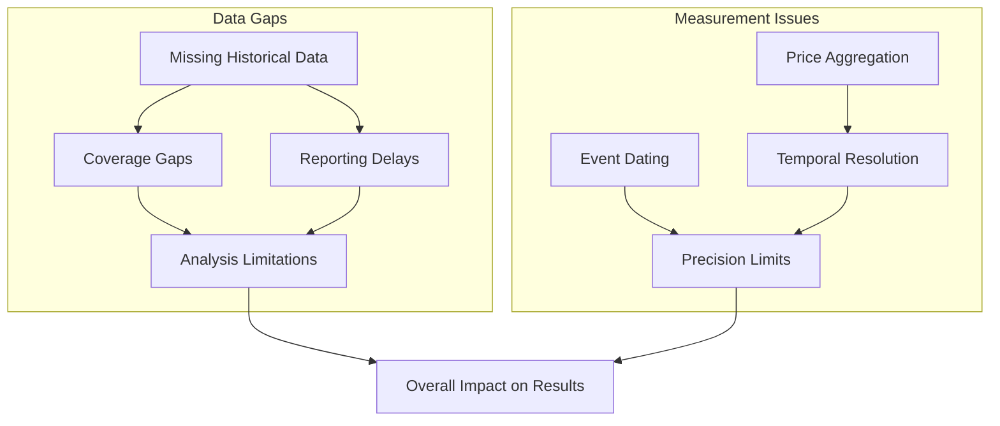
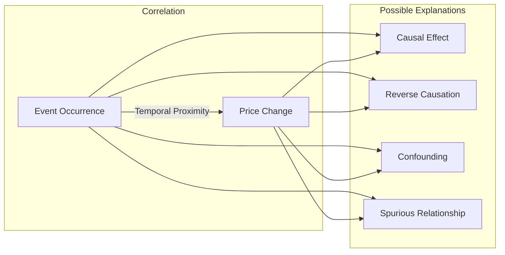
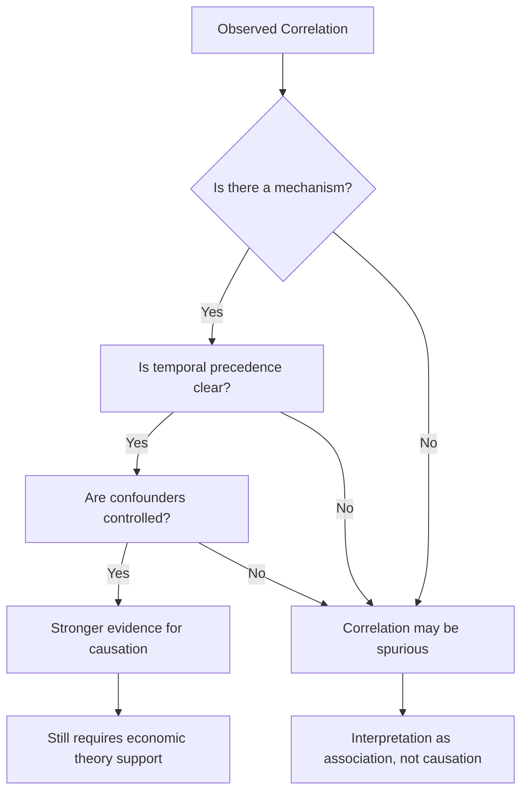
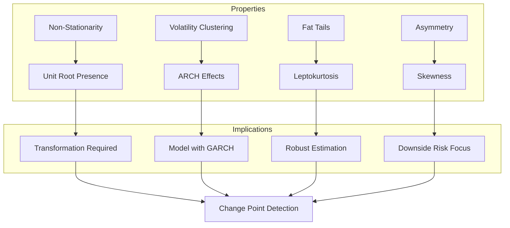
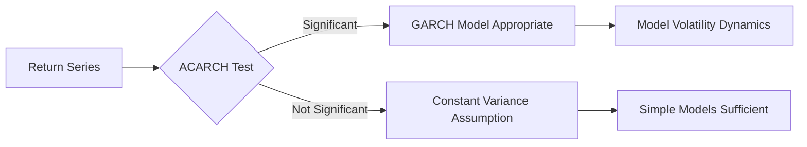
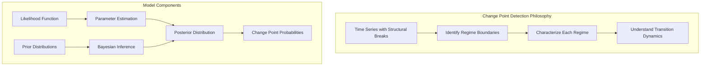
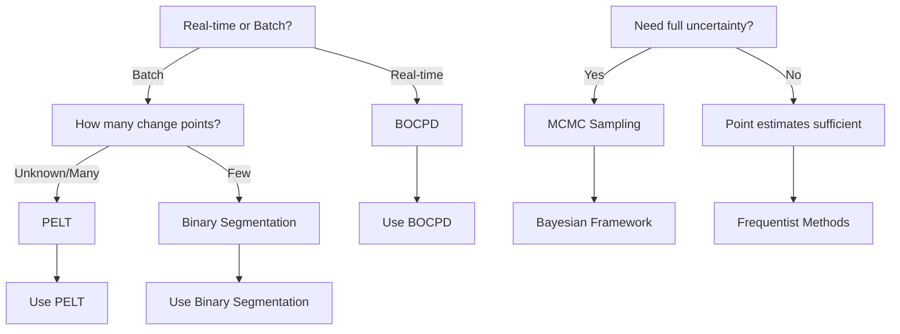

# Assumptions and Limitations Documentation

## Task 1: Laying the Foundation for Analysis

This document provides a comprehensive discussion of the assumptions, limitations, and methodological considerations underlying the Brent oil change point analysis.

---

## 1. Core Assumptions

### 1.1 Data Assumptions

| Assumption | Description                                       | Implication                                        |
| ---------- | ------------------------------------------------- | -------------------------------------------------- |
| **A1.1**   | Price data accurately reflects true market prices | Measurement error may affect results               |
| **A1.2**   | Missing data is randomly distributed              | Systematic missingness could bias results          |
| **A1.3**   | Outliers represent genuine market events          | Incorrect outlier identification distorts analysis |
| **A1.4**   | Event dates are accurately recorded               | Misdated events reduce mapping accuracy            |

### 1.2 Statistical Assumptions

| Assumption | Description                                    | Implication                             |
| ---------- | ---------------------------------------------- | --------------------------------------- |
| **A2.1**   | Returns are conditionally normally distributed | Heavy tails may require t-distribution  |
| **A2.2**   | Parameters are constant within regimes         | Abrupt changes may be misclassified     |
| **A2.3**   | Change points occur at discrete time points    | Gradual transitions may be missed       |
| **A2.4**   | Sufficient data exists in each regime          | Small segments yield unstable estimates |

### 1.3 Economic Assumptions

| Assumption | Description                               | Implication                                |
| ---------- | ----------------------------------------- | ------------------------------------------ |
| **A3.1**   | Oil prices respond to fundamental factors | Speculation may create noise               |
| **A3.2**   | Events have identifiable causal effects   | Confounding factors complicate attribution |
| **A3.3**   | Market efficiency (semi-strong form)      | Public information is rapidly incorporated |
| **A3.4**   | Regimes persist until next change point   | Quick reversion may be misclassified       |

---

## 2. Methodological Limitations

### 2.1 Data Limitations



#### 2.1.1 Temporal Resolution

- **Daily vs. Intra-day**: Change points may occur within trading days, not captured at daily granularity
- **Weekend/Holiday Gaps**: Non-trading days create artificial discontinuities
- **Data Start Date**: Analysis limited to May 1987 onwards

#### 2.1.2 Event Documentation

- **Reporting Lag**: Events may be recorded days after occurrence
- **Definition Uncertainty**: Event boundaries may be ambiguous
- **Completeness**: Not all relevant events may be documented

### 2.2 Model Limitations

#### 2.2.1 Bayesian Change Point Model Constraints

| Limitation | Description                                | Mitigation Strategy            |
| ---------- | ------------------------------------------ | ------------------------------ |
| **L1**     | Prior specification influences results     | Sensitivity analysis on priors |
| **L2**     | Computational intensity for large datasets | Use PELT for initial screening |
| **L3**     | Difficulty detecting simultaneous changes  | Sequential detection approach  |
| **L4**     | Regime count must be bounded               | Model selection criteria       |

#### 2.2.2 Model Misspecification Risks

1. **Wrong Likelihood**: Normal assumption may not hold
2. **Incorrect Regime Structure**: Fixed vs. stochastic regime boundaries
3. **Ignoring Exogenous Variables**: Conditional on price history only
4. **Stationarity Assumption**: May not hold in all regimes

---

## 3. Correlation vs. Causation Analysis

### 3.1 The Correlation-Causation Challenge



### 3.2 Correlation Does Not Imply Causation

#### 3.2.1 Evidence of Correlation

- **Temporal Association**: Events often precede price movements
- **Magnitude Correspondence**: Larger events tend to show larger price impacts
- **Directional Consistency**: Similar event types produce similar price reactions

#### 3.2.2 Why Correlation ≠ Causation

| Factor                | Explanation                    | Example                                                          |
| --------------------- | ------------------------------ | ---------------------------------------------------------------- |
| **Confounding**       | Third variable affects both    | Global recession affecting oil demand AND coinciding with events |
| **Reverse Causation** | Price changes influence events | Oil price rises leading to policy responses                      |
| **Selection Bias**    | Only notable events analyzed   | Ignoring events with no price impact                             |
| **Post Hoc Fallacy**  | Temporal order ≠ causal order  | Event follows a change already in progress                       |

### 3.3 Establishing Causality

#### 3.3.1 Causal Inference Framework



#### 3.3.2 Methods for Causal Assessment

| Method                        | Application                    | Limitation                           |
| ----------------------------- | ------------------------------ | ------------------------------------ |
| **Event Study**               | Abnormal returns around events | Event window definition arbitrary    |
| **Granger Causality**         | Predictive power testing       | Does not establish true causality    |
| **Instrumental Variables**    | Address confounding            | Valid instruments difficult to find  |
| **Difference-in-Differences** | Compare treated vs. control    | No true control group for oil market |
| **Structural Models**         | Economic theory-based          | Model misspecification risk          |

### 3.4 Project-Specific Causal Claims

#### 3.4.1 What We Can Claim

| Claim Type                  | Formulation                                 | Confidence Level          |
| --------------------------- | ------------------------------------------- | ------------------------- |
| **Association**             | "Event X is associated with price change Y" | High                      |
| **Temporal Precedence**     | "Event X preceded price change Y"           | High                      |
| **Predictive Relationship** | "Event X helps predict price change Y"      | Medium-High               |
| **Causal Effect**           | "Event X caused price change Y"             | Medium (requires caveats) |

#### 3.4.2 What We Cannot Claim

1. **Definitive Causation**: Without experimental design or natural experiments
2. **Quantified Impact**: Exact dollar/barrel impact is difficult to isolate
3. **Direction of Effect**: Whether price or event caused the other
4. **Generalizability**: Results may be period-specific

---

## 4. Time Series Properties Analysis

### 4.1 Stylized Facts of Oil Price Returns



### 4.2 Stationarity Analysis

#### 4.2.1 Unit Root Testing

| Test     | Null Hypothesis  | Alternative | Application                  |
| -------- | ---------------- | ----------- | ---------------------------- |
| **ADF**  | Unit root exists | Stationary  | Primary test for levels      |
| **PP**   | Unit root exists | Stationary  | Robust to heteroskedasticity |
| **KPSS** | Stationarity     | Unit root   | Complementary test           |
| **ERS**  | Unit root exists | Stationary  | DF-GLS variation             |

#### 4.2.2 Expected Results for Oil Prices

| Series               | Expected Test Outcome        | Action Required       |
| -------------------- | ---------------------------- | --------------------- |
| **Price Levels**     | Non-stationary (ADF rejects) | Use first differences |
| **Log Prices**       | Non-stationary               | Use log returns       |
| **Price Returns**    | Stationary                   | Proceed with analysis |
| **Absolute Returns** | Non-stationary               | Model with GARCH      |

### 4.3 Volatility Properties

#### 4.3.1 Volatility Clustering Evidence

- **Autocorrelation of Squared Returns**: High and persistent
- **Heteroskedasticity**: Variance changes systematically over time
- **Long Memory**: Volatility shocks have persistent effects

#### 4.3.2 GARCH Model Appropriateness



### 4.4 Regime-Switching Properties

| Property            | Within Regime     | Between Regimes         |
| ------------------- | ----------------- | ----------------------- |
| **Mean**            | Constant          | Shifts at change points |
| **Variance**        | Constant or GARCH | May shift               |
| **Autocorrelation** | Low               | May differ              |
| **Distribution**    | Normal/t          | May differ              |

---

## 5. Change Point Model Explanation

### 5.1 Conceptual Framework



### 5.2 Bayesian Change Point Model Specification

#### 5.2.1 Mathematical Formulation

Given observations $y_{1:T}$:

```
Segment 1: y[1:τ₁] ~ Distribution(θ₁)
Segment 2: y[τ₁+1:τ₂] ~ Distribution(θ₂)
...
Segment k: y[τₖ₋₁+1:τₖ] ~ Distribution(θₖ)
```

Where:

- $\tau = (\tau_1, \tau_2, ..., \tau_k)$ are change points
- $\theta_i$ are regime-specific parameters
- Number of regimes $k$ is random

#### 5.2.2 Prior Specifications

| Parameter                   | Prior Distribution   | Rationale                  |
| --------------------------- | -------------------- | -------------------------- |
| **Change Point Locations**  | Geometric(p)         | Memoryless waiting time    |
| **Number of Change Points** | Poisson(λ)           | Count data approximation   |
| **Regime Parameters**       | Normal-Inverse-Gamma | Conjugate prior for normal |
| **Hyperparameters**         | Weakly Informative   | Minimize prior influence   |

### 5.3 Detection Algorithms

#### 5.3.1 Algorithm Comparison

| Algorithm               | Type     | Complexity        | Best For           |
| ----------------------- | -------- | ----------------- | ------------------ |
| **Binary Segmentation** | Offline  | O(n²)             | Few change points  |
| **PELT**                | Offline  | O(n)              | Many change points |
| **BOCPD**               | Online   | O(n)              | Streaming data     |
| **MCMC**                | Bayesian | O(n × iterations) | Full posterior     |

#### 5.3.2 Algorithm Selection Decision Tree



### 5.4 Model Interpretation

#### 5.4.1 Change Point Probabilities

- **Posterior Probability**: $P(\tau_i | y_{1:T})$ - probability change occurred at $i$
- **Highest Probability Density (HPD) Interval**: Range containing change point with specified confidence
- **Model Selection**: Bayes Factors or BIC for regime count selection

#### 5.4.2 Regime Characterization

| Regime Property | Interpretation          | Economic Meaning                   |
| --------------- | ----------------------- | ---------------------------------- |
| **Mean Level**  | Average price in regime | Market sentiment/demand conditions |
| **Volatility**  | Price variability       | Uncertainty/market stress          |
| **Trend**       | Price direction         | Structural bull/bear market        |
| **Duration**    | Regime persistence      | Stability of conditions            |

### 5.5 Model Limitations

| Limitation               | Description                                   | Impact on Results                     |
| ------------------------ | --------------------------------------------- | ------------------------------------- |
| **Detected ≠ True**      | Algorithm may identify noise as change points | False positives require filtering     |
| **Missed Changes**       | Small changes below detection threshold       | False negatives reduce sensitivity    |
| **Boundary Effects**     | Less accurate near series ends                | Truncated regime analysis             |
| **Simultaneous Changes** | Cannot resolve changes at same time point     | Lump-sum effects may be misattributed |

---

## 6. Sensitivity Analysis Framework

### 6.1 Sensitivity Parameters

| Parameter                       | Range         | Effect on Detection                    |
| ------------------------------- | ------------- | -------------------------------------- |
| **Prior Probability of Change** | 0.01 - 0.10   | Higher values → more changes detected  |
| **Minimum Segment Length**      | 20 - 100 days | Longer → fewer, more robust detections |
| **Threshold Significance**      | 0.05 - 0.20   | Higher → more detections               |

### 6.2 Robustness Checks

1. **Alternative Algorithms**: Compare BOCPD, PELT, Binary Segmentation
2. **Different Priors**: Vary prior specifications, assess stability
3. **Subsample Analysis**: Split data, compare results
4. **Placebo Testing**: Random events, check for spurious detections

---

## 7. Caveats and Best Practices

### 7.1 Interpretation Guidelines

1. **Change points indicate regime changes, not their causes**
2. **Event correlation does not establish causality**
3. **Results are sample-specific and time-bound**
4. **Model assumptions must be verified empirically**

### 7.2 Best Practices

| Practice                       | Description                                 |
| ------------------------------ | ------------------------------------------- |
| **Multiple Methods**           | Use >1 detection algorithm                  |
| **Visual Inspection**          | Plot results, verify against raw data       |
| **Sensitivity Analysis**       | Report results across parameter ranges      |
| **Uncertainty Quantification** | Report confidence intervals                 |
| **Economic Interpretation**    | Contextualize results with domain knowledge |

---

## 8. References

### 8.1 Time Series Analysis

- Box, G.E.P., Jenkins, G.M., & Reinsel, G.C. (2015). Time Series Analysis: Forecasting and Control.
- Hamilton, J.D. (1994). Time Series Analysis. Princeton University Press.

### 8.2 Change Point Detection

- Chen, J., & Gupta, A.K. (2012). Parametric Statistical Change Point Analysis.
- Fearnhead, P., & Rigaill, G. (2019). Changepoint Detection in the Presence of Outliers.

### 8.3 Bayesian Methods

- Gelman, A., et al. (2013). Bayesian Data Analysis, 3rd Edition.
- Adams, R.P., & MacKay, D.J. (2007). Bayesian Online Changepoint Detection.

### 8.4 Oil Markets

- Kilian, L. (2009). Not All Oil Price Shocks Are Alike: Disentangling Demand and Supply Shocks in the Crude Oil Market.
- Hamilton, J.D. (2003). What is an Oil Shock? Journal of Econometrics.

---

## 9. Version Information

| Version | Date       | Changes                                                   |
| ------- | ---------- | --------------------------------------------------------- |
| 1.0     | 2024-01-15 | Initial assumptions documentation                         |
| 1.1     | 2024-02-06 | Enhanced causal inference section, added Mermaid diagrams |

---

_Document Version: 1.1_  
_Last Updated: February 6, 2024_  
_Project: Brent Oil Change Point Analysis_
