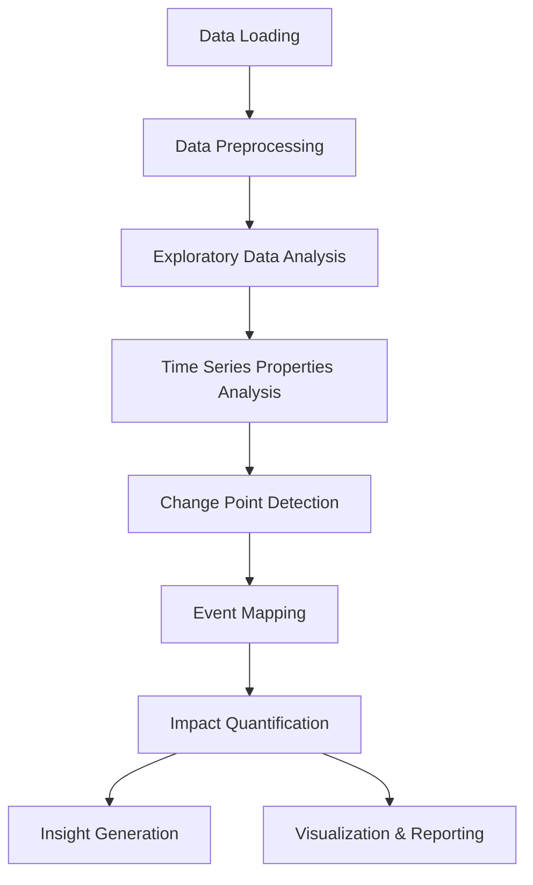
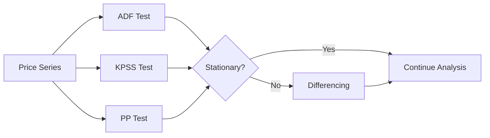
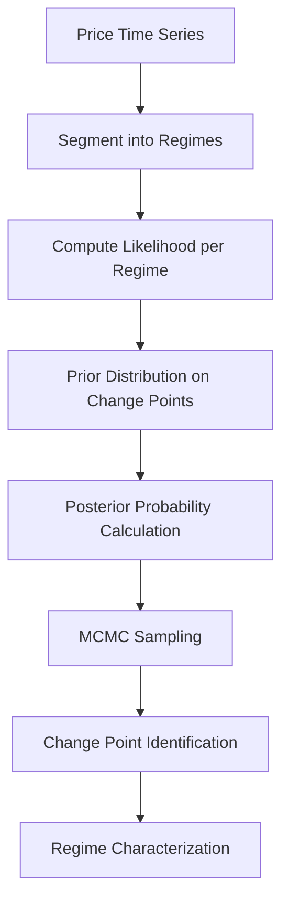
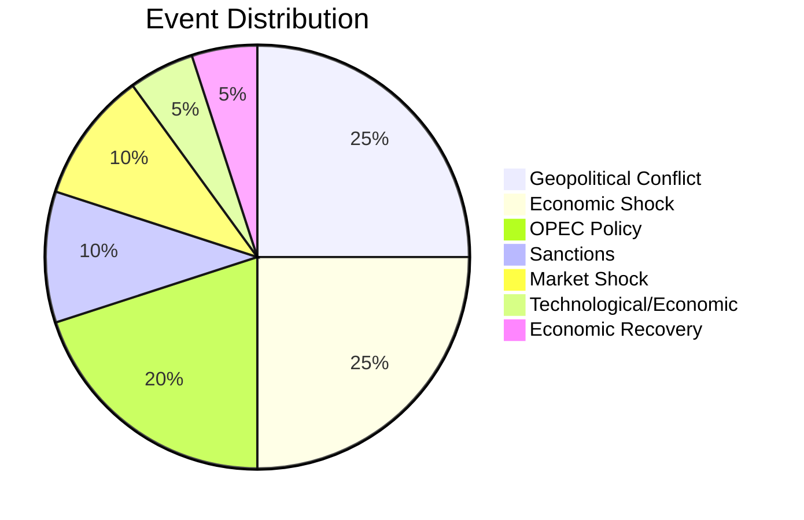

# Methodology Documentation

## Task 1: Laying the Foundation for Analysis

This document outlines the comprehensive methodology for analyzing Brent crude oil prices and identifying structural change points driven by geopolitical events, OPEC decisions, and economic shocks.

---

## 1. Analysis Pipeline Overview



---

## 2. Data Loading and Ingestion

### 2.1 Data Sources

| Data Source       | Format | Description                                                        |
| ----------------- | ------ | ------------------------------------------------------------------ |
| Brent Oil Prices  | CSV    | Daily Brent crude oil prices from May 1987 to present              |
| Historical Events | CSV    | Curated dataset of major geopolitical, economic, and policy events |

### 2.2 Data Schema

**BrentOilPrices.csv:**

- `Date`: Trading date in DD-Mon-YY format
- `Price`: Daily closing price in USD per barrel

**events.csv:**

- `event_id`: Unique identifier
- `event_name`: Descriptive name of the event
- `event_type`: Category (Geopolitical Conflict, Economic Shock, OPEC Policy, Sanctions, etc.)
- `start_date`: Event start date in YYYY-MM-DD format
- `description`: Detailed description of the event impact

---

## 3. Data Preprocessing Steps

### 3.1 Price Data Processing

1. **Date Parsing**: Convert date strings to standardized datetime objects
2. **Missing Value Treatment**: Handle missing trading days using forward-fill or interpolation
3. **Outlier Detection**: Identify and flag extreme price movements (>3 standard deviations)
4. **Return Calculation**: Compute daily log returns: `r_t = ln(P_t / P_{t-1})`
5. **Resampling**: Aggregate to weekly/monthly for trend analysis when needed

### 3.2 Event Data Processing

1. **Date Standardization**: Ensure consistent date formats across all events
2. **Categorization**: Classify events into predefined categories
3. **Impact Scoring**: Preliminary assessment of expected market impact

---

## 4. Exploratory Data Analysis

### 4.1 Price Series Visualization

- Time series plots with trend identification
- Rolling statistics (mean, volatility) over sliding windows
- Distribution analysis of price returns

### 4.2 Key Statistics Computed

| Statistic        | Description                                    |
| ---------------- | ---------------------------------------------- |
| Mean Price       | Average closing price over the analysis period |
| Volatility       | Standard deviation of daily returns            |
| Skewness         | Asymmetry of return distribution               |
| Kurtosis         | Tail thickness of return distribution          |
| Max Drawdown     | Largest peak-to-trough decline                 |
| Auto-correlation | Correlation of returns with lagged values      |

---

## 5. Time Series Properties Analysis

### 5.1 Stationarity Testing



### 5.2 Key Properties Investigated

1. **Unit Root Testing**: Augmented Dickey-Fuller (ADF) test
2. **Trend Analysis**: Is there a long-term upward/downward trend?
3. **Seasonality**: Periodic patterns in prices and volatility
4. **Long Memory**: Hurst exponent estimation
5. **Volatility Clustering**: ARCH/GARCH effects

### 5.3 Expected Findings

- **Level 1**: Oil prices typically non-stationary in levels
- **Level 2**: First differences (returns) are typically stationary
- **Level 3**: Significant volatility clustering expected
- **Level 4**: Structural breaks during major events

---

## 6. Change Point Detection Methodology

### 6.1 Bayesian Change Point Model



### 6.2 Model Specification

The Bayesian change point model assumes:

- **Regime Structure**: Time series divided into contiguous segments
- **Within-Regime Model**: Each segment follows a distinct distribution
- **Parameter Priors**: Weakly informative priors on all parameters
- **Change Point Prior**: Geometric distribution for waiting times

### 6.3 Detection Algorithms

| Algorithm                              | Description                                                     | Strengths                    |
| -------------------------------------- | --------------------------------------------------------------- | ---------------------------- |
| Bayesian Online Change Point Detection | Real-time detection with posterior probabilities                | Probabilistic interpretation |
| PELT                                   | Pruned Exact Linear Time - efficient for multiple change points | Computationally efficient    |
| Binary Segmentation                    | Recursive binary partitioning                                   | Simple implementation        |
| BOCPD                                  | Bayesian Online Change Point Detection                          | Streaming capability         |

---

## 7. Event Mapping Framework

### 7.1 Event Categorization



### 7.2 Major Events Research Summary

#### 7.2.1 Geopolitical Conflicts

| Event              | Date     | Impact Mechanism                          |
| ------------------ | -------- | ----------------------------------------- |
| Gulf War Crisis    | Aug 1990 | Supply disruption fears in Persian Gulf   |
| 9/11 Attacks       | Sep 2001 | Economic uncertainty, demand destruction  |
| Iraq War           | Mar 2003 | Supply concerns, war premium              |
| Arab Spring        | Jan 2011 | Regional instability, supply risk premium |
| Libya Civil War    | Feb 2011 | Actual production losses (~1.5 mbpd)      |
| Russia-Ukraine War | Feb 2022 | Sanctions on major exporter, supply fears |

#### 7.2.2 OPEC Decisions

| Event                         | Date     | Impact Mechanism                       |
| ----------------------------- | -------- | -------------------------------------- |
| OPEC Production Surge         | Nov 2014 | Market share strategy, price collapse  |
| OPEC Production Cut Agreement | Nov 2016 | Supply constraint, price stabilization |
| OPEC+ Price War               | Mar 2020 | Extreme volatility, price crash        |
| OPEC+ Production Cuts         | Oct 2022 | Price support amid demand concerns     |

#### 7.2.3 Economic Shocks

| Event                   | Date     | Impact Mechanism                          |
| ----------------------- | -------- | ----------------------------------------- |
| Asian Financial Crisis  | Jul 1997 | Demand destruction in Asia                |
| Global Financial Crisis | Sep 2008 | Demand collapse, risk premium evaporation |
| COVID-19 Pandemic       | Mar 2020 | Historic demand destruction               |
| Global Inflation Shock  | 2022     | Monetary tightening, demand destruction   |

#### 7.2.4 Sanctions

| Event                        | Date     | Impact Mechanism                             |
| ---------------------------- | -------- | -------------------------------------------- |
| Iran Nuclear Deal Withdrawal | May 2018 | Supply reduction from Iranian exports        |
| EU Russian Oil Ban           | Jun 2022 | Supply chain restructuring, premium increase |

---

## 8. Impact Quantification Methods

### 8.1 Pre-Post Event Analysis

```
Impact Measure = Post-Event Statistic - Pre-Event Statistic
```

### 8.2 Volatility Analysis

1. **Realized Volatility**: Standard deviation of returns in rolling windows
2. **Implied Volatility**: Market expectations of future volatility
3. **Volatility Jump Detection**: Identification of abrupt volatility changes

### 8.3 Return Analysis

1. **Cumulative Returns**: Total return over event windows
2. **Abnormal Returns**: Returns in excess of expected (market model)
3. **Event Study Methodology**: Statistical significance testing

---

## 9. Stakeholder Communication Channels

### 9.1 Dashboard Interface

The interactive dashboard provides:

- **Change Point Chart**: Visual identification of regime changes
- **Event Timeline**: Chronological overlay of major events
- **Filter Controls**: Date range, event type, price threshold
- **Pie Charts**: Distribution analysis by event category

### 9.2 API Endpoints

| Endpoint             | Method | Description                                          |
| -------------------- | ------ | ---------------------------------------------------- |
| `/api/prices`        | GET    | Retrieve price data with optional filters            |
| `/api/change-points` | GET    | Get detected change points with confidence intervals |
| `/api/events`        | GET    | Retrieve event data with metadata                    |

### 9.3 Report Generation

- **Change Point Results**: Detailed analysis of structural breaks
- **Foundation Report**: Comprehensive methodology documentation
- **Visual Reports**: HTML/PDF visualizations with annotations

---

## 10. Quality Assurance Procedures

### 10.1 Data Validation

- [ ] Price data completeness check (>95% coverage)
- [ ] Date format standardization verification
- [ ] Outlier flagging and review
- [ ] Event date accuracy confirmation

### 10.2 Model Validation

- [ ] Backtesting against known historical events
- [ ] Cross-validation with alternative detection methods
- [ ] Sensitivity analysis on prior specifications
- [ ] Convergence diagnostics for MCMC algorithms

### 10.3 Output Review

- [ ] Change point reasonableness assessment
- [ ] Event mapping verification
- [ ] Visualization clarity check
- [ ] Report completeness review

---

## 11. Dependencies and Tools

### 11.1 Python Libraries

```python
# Core Analysis
numpy>=1.21.0
pandas>=1.3.0
scipy>=1.7.0

# Statistical Modeling
pymc>=4.0.0
arch>=5.0.0
statsmodels>=0.13.0

# Visualization
matplotlib>=3.5.0
plotly>=5.10.0
seaborn>=0.11.0

# Data Handling
requests>=2.27.0
```

### 11.2 Dashboard Stack

- **Backend**: Flask/FastAPI (Python)
- **Frontend**: React.js with Plotly.js visualizations
- **Deployment**: Docker containerization

---

## 12. References and Further Reading

### 12.1 Academic Literature

- Adams, Z., & Glück, T. (2015). Financialization in commodity markets: A passing phenomenon or the new normal?
- Cheng, I., & Xiong, W. (2014). Financialization of commodity markets. Annual Review of Financial Economics.
- Hamilton, J. D. (2009). Causes and Consequences of the Oil Shock of 2007-08. Brookings Papers on Economic Activity.

### 12.2 Data Sources

- U.S. Energy Information Administration (EIA)
- OPEC Official Website and Reports
- Bloomberg Terminal
- Federal Reserve Economic Data (FRED)

---

## 13. Version Information

| Version | Date       | Changes                                               |
| ------- | ---------- | ----------------------------------------------------- |
| 1.0     | 2024-01-15 | Initial methodology documentation                     |
| 1.1     | 2024-02-06 | Enhanced event categorization, added Mermaid diagrams |

---

_Document Version: 1.1_  
_Last Updated: February 6, 2024_  
_Project: Brent Oil Change Point Analysis_
